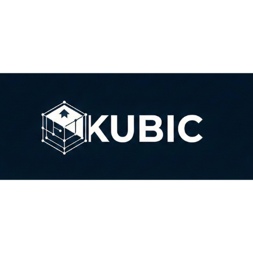

# KubicEng - Construction Management Dashboard



Platforma completa para gestão de construtoras, integrando Engenharia, Financeiro, Suprimentos e Execução.

## Funcionalidades Principais

- **Engenharia**: Gestão de documentos (GED) e cronogramas.
- **Financeiro**: Controle de orçamentos, Curva ABC e fluxo de caixa.
- **Suprimentos**: Gestão de compras e estoque.
- **Execução**: Diário de obras e acompanhamento de campo.
- **Landing Page**: Página inicial com planos e preços dinâmicos (Mensal/Anual).
- **Autenticação**: Fluxo de Login e Cadastro com opção de CPF/CNPJ.
- **Planos**: Start, Pro (Teste Grátis 7 dias), Business e Personalizado.

## Tecnologias

- **Frontend**: React, Vite, TypeScript, Tailwind CSS v4.
- **UI**: Shadcn UI, Recharts, Lucide Icons.
- **Backend**: Node.js, Fastify, Prisma, SQLite.
- **Pagamentos**: [Integração ASAAS](docs/INTEGRACAO_ASAAS.md) (Planejado).
- **Testes**: Vitest, React Testing Library.

## Como Rodar o Projeto

1. Instale as dependências:
   ```bash
   npm install
   ```
   *Nota: Instale também as dependências do backend na pasta `backend`.*

2. Inicie o banco de dados (Backend):
   ```bash
   cd backend
   npx prisma generate
   npx prisma db push
   npm run dev
   ```

3. Inicie o Frontend:
   ```bash
   # Em outro terminal, na raiz do projeto
   npm run dev
   ```

4. Acesse `http://localhost:5173` no seu navegador.

## Licença

Propriedade de KubicEng. Todos os direitos reservados.